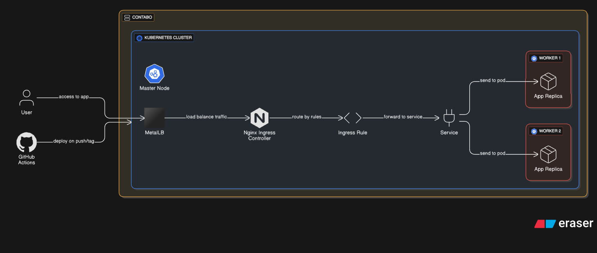

# Demo Devops Python

This is a simple application to be used in the technical test of DevOps. The application can be accessed at https://stevencode.dev/api/

## Getting Started

### Prerequisites

- Python 3.13
- Docker and Docker Compose
- Terraform (for infrastructure deployment)
- Pipenv (for virtual environment management)
- Git

### Installation

#### Option 1: Traditional Python Setup

Clone this repo.

```bash
git clone https://github.com/StevenMartinez94/devsu-test/
cd devsu-test
```

Install dependencies.

```bash
pip install -r requirements.txt
```

#### Option 2: Using Pipenv (Recommended)

Clone this repo.

```bash
git clone https://github.com/StevenMartinez94/devsu-test/
cd devsu-test
```

Install Pipenv if you haven't already:

```bash
pip install pipenv
```

Install dependencies and create virtual environment:

```bash
pipenv install
```

Activate the virtual environment:

```bash
pipenv shell
```

#### Option 3: Using Docker

Clone this repo.

```bash
git clone https://github.com/StevenMartinez94/devsu-test/
cd demo-devops-python
```

Build and run with Docker Compose:

```bash
docker-compose up --build
```

### Database

The database is generated as a file in the main path when the project is first run, and its name is `db.sqlite3`. Consider giving access permissions to the file for proper functioning.

Migrate database (not if using Docker):

```bash
python manage.py makemigrations
python manage.py migrate
```

## Usage

### Running the Application

#### Local Development

To run tests you can use this command.

```bash
python manage.py test
```

To run locally the project you can use this command.

```bash
python manage.py runserver
```

#### Using Pipenv

```bash
# Run tests
pipenv run python manage.py test

# Run the development server
pipenv run python manage.py runserver
```

#### Using Docker

The application will be automatically available at http://localhost:8000 when using Docker Compose.
Open http://localhost:8000/api/ with your browser to see the result.

## DevOps & Infrastructure

### Diagram


#### Notes

*Why on-premises?*
The main reason for choosing on-premises deployment here is to demonstrate the ability to set up a Kubernetes cluster on a bare-metal server, which is a common scenario in DevOps practices.
Also, on-premises deployment offers greater control over the infrastructure and data, which can be crucial for certain applications and compliance requirements.

*Why Contabo?*
Contabo provides affordable cloud infrastructure with reliable performance, making it suitable for deploying small applications.
For production, I would rather consider using a more robust provider like AWS or GCP.

*What else I would need to deploy a project like this?*
You would need a domain name and to apply some k8s manifest as:

```bash
# Install cert-manager for automated TLS certificates
kubectl apply -f https://github.com/cert-manager/cert-manager/releases/latest/download/cert-manager.yaml

# Install MetalLB for bare-metal load balancing
kubectl apply -f https://raw.githubusercontent.com/metallb/metallb/v0.15.2/config/manifests/metallb-native.yaml

# Install ingress-nginx for HTTP ingress routing
kubectl apply -f https://github.com/kubernetes/ingress-nginx/blob/main/deploy/static/provider/baremetal/deploy.yaml
```

### Docker

This project includes Docker support for containerized deployment.

#### Docker Components

- **Dockerfile**: Multi-stage build with Python 3.13-slim base image
- **docker-compose.yml**: Local development orchestration
- **Security**: Runs as non-root user (apiuser:1000)
- **Health Checks**: Built-in health monitoring at `/api` endpoint
- **Logging**: JSON file driver with rotation (10MB max, 3 files)

#### Docker Commands

```bash
# Build the image
docker build -t restful-api .

# Run with Docker Compose
docker-compose up -d

# View logs
docker-compose logs -f restful-api

# Stop services
docker-compose down

# Rebuild and restart
docker-compose up --build --force-recreate
```

### Terraform Infrastructure

The project includes Terraform configuration for deploying Kubernetes infrastructure on Contabo cloud provider.

#### Infrastructure Components

- **3 Contabo instances**: 1 master + 2 worker nodes
- **Kubernetes cluster**: Ready for application deployment

#### Terraform Commands

```bash
cd terraform

# Initialize Terraform
terraform init

# Plan the deployment
terraform plan

# Apply the infrastructure
terraform apply

# View outputs (IPs, instance IDs)
terraform output

# Destroy infrastructure
terraform destroy
```

#### Required Variables

Create a `terraform.tfvars` file with:

```hcl
oauth2_client_id     = "your-contabo-client-id"
oauth2_client_secret = "your-contabo-client-secret"
oauth2_user          = "your-contabo-user"
oauth2_pass          = "your-contabo-password"
product_id           = "your-product-id"
region               = "your-region"
image_id             = "your-image-id"
```

### Kubernetes Deployment

The `k8s/manifests/` directory contains Kubernetes deployment files:

- **namespace.yaml**: Application namespace
- **deployment.yaml**: Application deployment configuration
- **service.yaml**: Service exposure
- **ingress.yaml**: Ingress rules and certificate setup
- **pv.yaml & pvc.yaml**: Persistent volume configuration

**NOTE**: You may need to create a Kubernetes secret for the Django secret key inside the demo-app namespace, you can do it using the following command:

```bash
kubectl create secret generic demo-app-secrets \
  --namespace=demo-app \
  --from-literal=django-secret-key='your-django-secret-key'
```

### GitHub Actions CI/CD

The project implements a comprehensive CI/CD pipeline using GitHub Actions with 6 automated workflows that ensure code quality, security, and reliable deployments.

#### Workflow Overview

The CI/CD pipeline follows a sequential execution pattern:

```
Lint → Build & Test → Docker Build → Vulnerability Scan & Code Coverage → Deploy
```

#### CI/CD Workflow Summary

The project uses six GitHub Actions workflows for automated quality, security, and deployment:

1. **Lint:** Checks Python, YAML, and Terraform formatting.
2. **Build & Test:** Runs Django tests after linting, using secrets for configuration.
3. **Docker Build & Push:** Builds and pushes Docker images to GHCR after tests pass.
4. **Vulnerability Scan:** Scans built images for security issues using Trivy.
5. **Code Coverage:** Measures and reports test coverage.
6. **Deploy:** Deploys to Kubernetes using updated manifests and secrets.

#### Required GitHub Repository Secrets

To enable full CI/CD functionality, configure these secrets in your repository:

```bash
# Django Application
DJANGO_SECRET_KEY=your-secure-django-secret-key

# Kubernetes Deployment
KUBECONFIG_B64=base64-encoded-kubeconfig-content
```

#### How to Generate Required Secrets

**Django Secret Key:**
```bash
python -c "from django.core.management.utils import get_random_secret_key; print(get_random_secret_key())"
```

**Kubeconfig (Base64):**
```bash
# Encode your kubeconfig file
cat ~/.kube/config | base64 -w 0
```

#### Workflow Features

**Security Features:**
- Container image scanning for OS and application vulnerabilities
- SARIF security reporting format

**Quality Assurance:**
- Multi-language linting (Python, YAML, Terraform)
- Automated testing
- Code coverage reporting

**Deployment Features:**
- Tag-based versioning
- Automatic image tagging
- Rolling deployments to Kubernetes
- Multi-environment support

**Container Registry:**
- GitHub Container Registry (GHCR) integration
- Automatic image cleanup and tagging
- Multi-architecture support ready

#### Local Development Integration

Developers can run similar checks locally:

```bash
# Run linting checks
black --check .
yamllint .
terraform fmt -check -recursive

# Run tests
python manage.py test api

# Build Docker image locally
docker build -t restful-api:local .
```

#### Environment Variables

Create a `.env` file for local development:

```env
DJANGO_SECRET_KEY=your-django-secret-key
DATABASE_NAME=db.sqlite3
```

### Monitoring & Logging

#### Docker Logging

Logs are configured with rotation to prevent disk space issues:

```yaml
logging:
  driver: json-file
  options:
    max-size: 10m
    max-file: "3"
```

#### Health Checks

The application includes health monitoring:

```yaml
healthcheck:
  test: ["CMD", "curl", "-f", "http://localhost:8000/api"]
  interval: 30s
  timeout: 10s
  retries: 5
```
## API Documentation
### Features

These services can perform:

#### Create User

To create a user, the endpoint **/api/users/** must be consumed with the following parameters:

```bash
  Method: POST
```

```json
{
    "dni": "dni",
    "name": "name"
}
```

If the response is successful, the service will return an HTTP Status 200 and a message with the following structure:

```json
{
    "id": 1,
    "dni": "dni",
    "name": "name"
}
```

If the response is unsuccessful, we will receive status 400 and the following message:

```json
{
    "detail": "error"
}
```

#### Get Users

To get all users, the endpoint **/api/users** must be consumed with the following parameters:

```bash
  Method: GET
```

If the response is successful, the service will return an HTTP Status 200 and a message with the following structure:

```json
[
    {
        "id": 1,
        "dni": "dni",
        "name": "name"
    }
]
```

#### Get User

To get an user, the endpoint **/api/users/<id>** must be consumed with the following parameters:

```bash
  Method: GET
```

If the response is successful, the service will return an HTTP Status 200 and a message with the following structure:

```json
{
    "id": 1,
    "dni": "dni",
    "name": "name"
}
```

If the user id does not exist, we will receive status 404 and the following message:

```json
{
    "detail": "Not found."
}
```

## License

Copyright © 2023 Devsu. All rights reserved.
